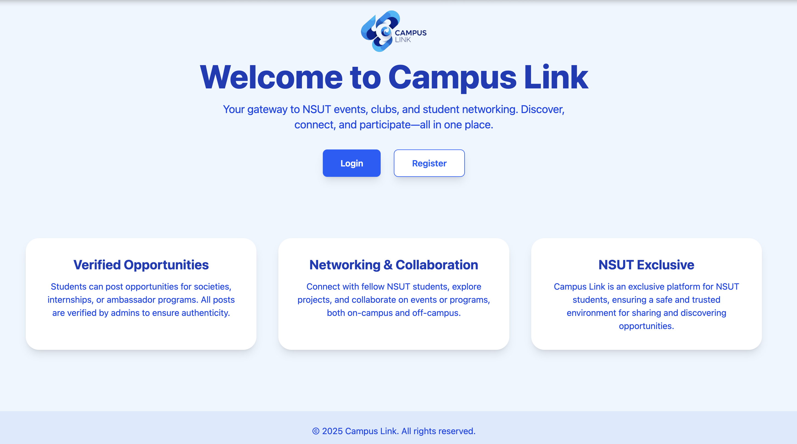
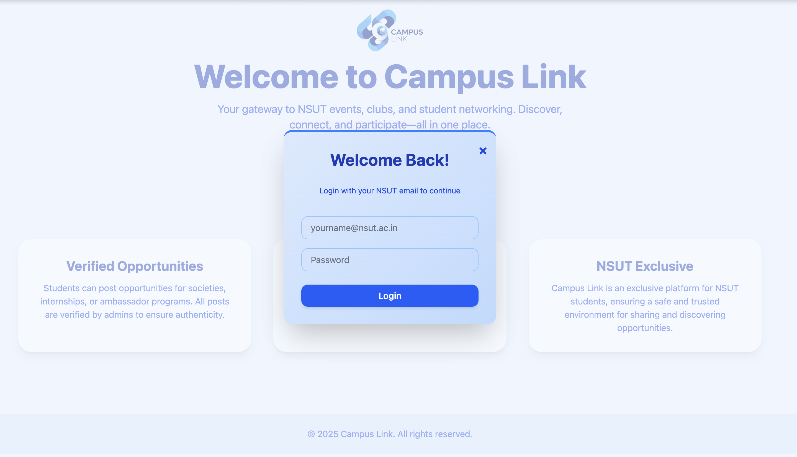
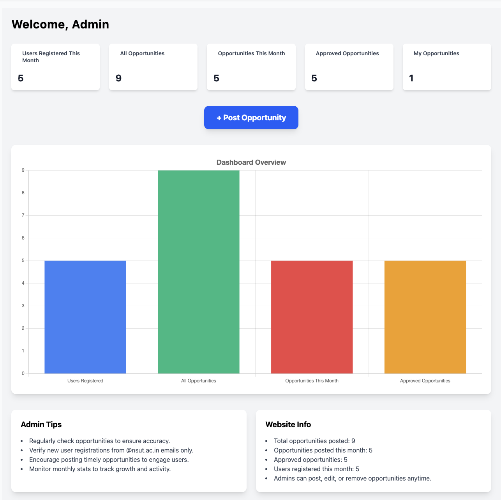
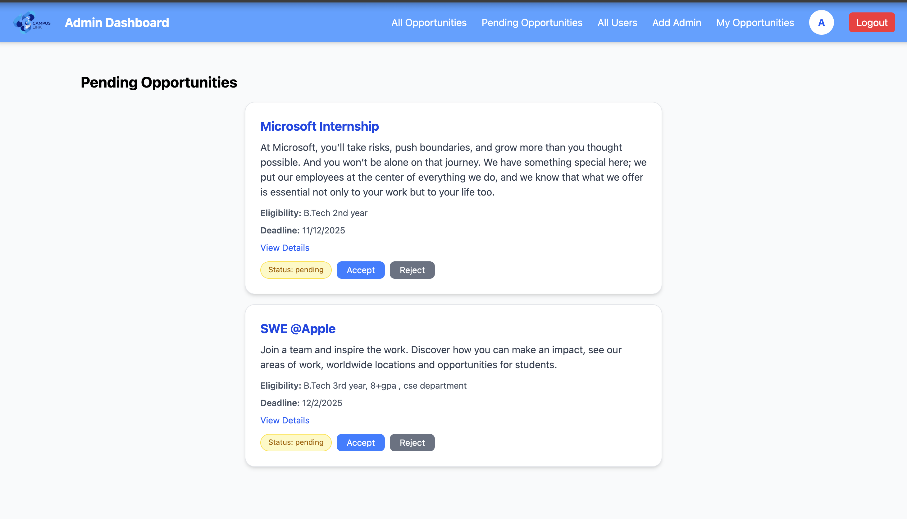
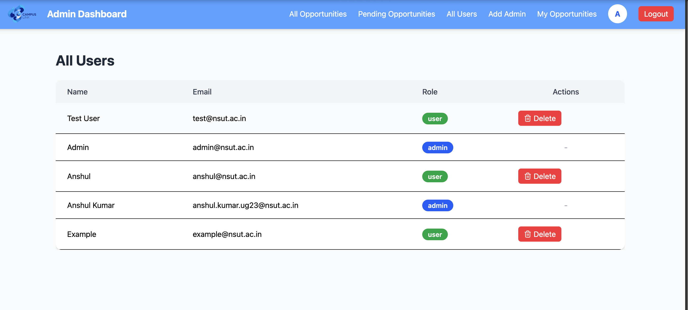
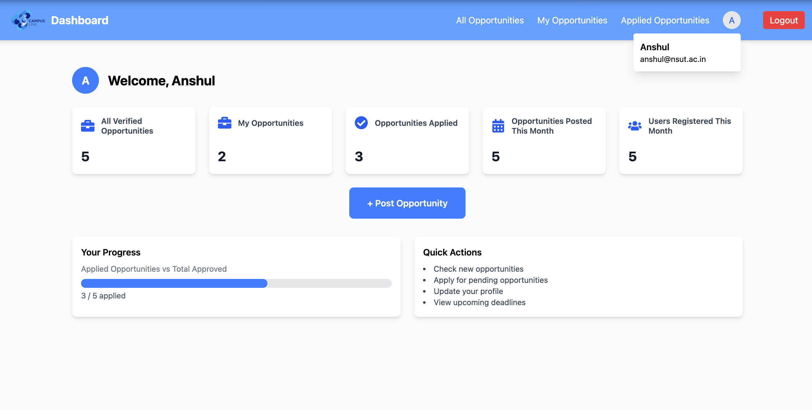
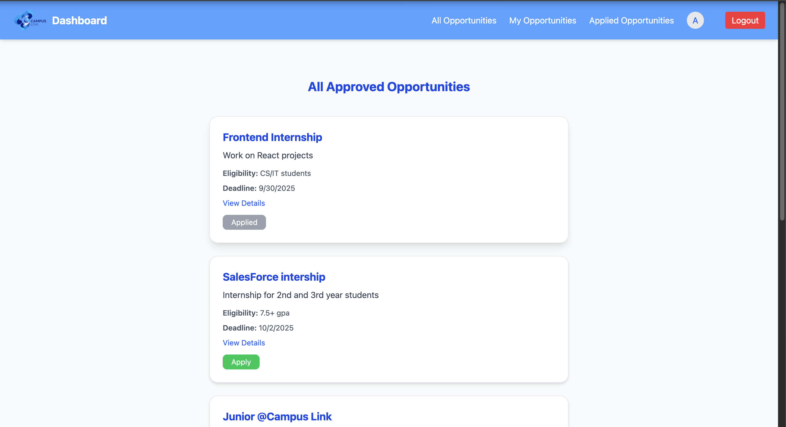
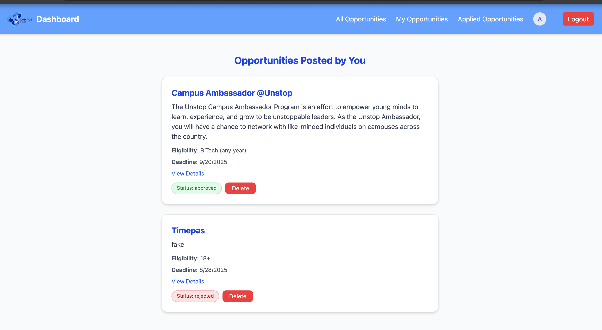

# Campus Link

**Campus Link** is a web application designed for NSUT students to discover, post, and apply to various opportunities such as internships, workshops, and events. It provides a seamless interface for both students and admins to manage and track opportunities.

**Hosted Link:** [Campus Link Live](https://your-hosted-link.com)  

---

## Table of Contents

- [Features](#features)  
- [Screenshots](#screenshots)  
- [Tech Stack](#tech-stack)  
- [Installation](#installation)  
- [Folder Structure](#folder-structure)  
- [Usage](#usage)  
- [Contribution](#contribution)  
- [License](#license)  

---

## Features

### For Students:
- Browse all approved opportunities.  
- Apply to opportunities with a single click.  
- Track applied opportunities.  
- View your own posted opportunities.  

### For Admins:
- Approve and manage opportunities.  
- Post new opportunities through a modal form.  
- Delete or edit existing opportunities.  
- Monitor monthly statistics (users registered, total opportunities, approved opportunities).  

### Dashboard:
- Interactive charts showing key statistics.  
- Admin tips and website info for better management.  

---

## Screenshots

| Page | Screenshot |
|------|------------|
| Home Page |  |
| Login Page |  |
| Admin - Dashboard |  |
| Pending Opportunity (For Admin) |  |
| All Users (For Admin) |  |
| User - Dashboard |  |
| All verified opportunies |  |
| Opportunies posted by user |  |

---

## Tech Stack

- **Frontend:** React, TailwindCSS  
- **Backend:** Node.js, Express  
- **Database:** MongoDB  
- **Authentication:** JWT  
- **Visualization:** Chart.js  
- **File Uploads:** Multer (plan to migrate to Cloudinary)  
- **Notifications:** React Toastify  

---

## Installation

# Clone the repository
git clone https://github.com/your-username/campus-link.git
cd campus-link

# Install dependencies
npm install

# Create .env file with the following content (replace with your values)
echo "MONGO_URI=your_mongodb_connection_string
JWT_SECRET=your_jwt_secret
PORT=5000" > .env

# Run backend server
npm run server &

# Run frontend
npm start

---

## Usage

- Register/login as a student or admin.  
- Students can browse, apply, and post opportunities.  
- Admins can approve, edit, or delete opportunities and monitor statistics.  
- Toast notifications will appear on actions such as successful application, approval, or error messages.  

---

## Contribution

1. Fork the repository.  
2. Create your feature branch: `git checkout -b feature/your-feature-name`  
3. Commit your changes: `git commit -m "Add your message"`  
4. Push to the branch: `git push origin feature/your-feature-name`  
5. Open a pull request.  

---

